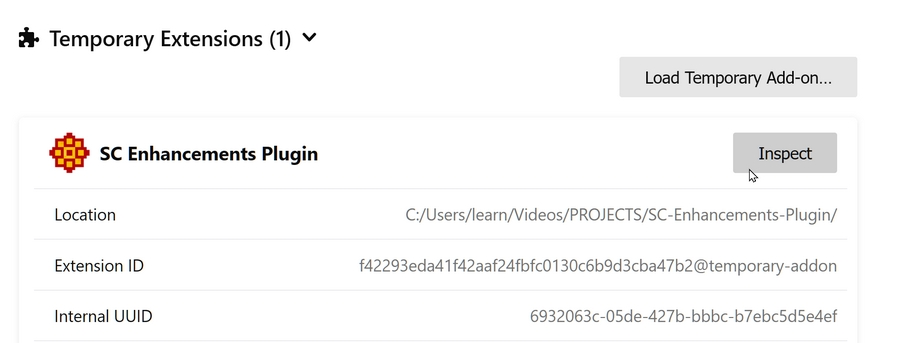

# SC-Enhancements-Plugin

A browser plugin to add enhancements to the SuttaCentral website

## Development:

The same code should be able to run on both FireFox and Chrome.

To get live updates on Chrome, you can use [Advanced Extension Reloader](https://chromewebstore.google.com/detail/advanced-extension-reload/hagknokdofkmojolcpbddjfdjhnjdkae?hl=en).

To run on Firefox:

```
web-ext run
```

### Debugging in Firefox

Go to

```
about:debugging#/runtime/this-firefox
```

and find this extension. Then click "inspect"


